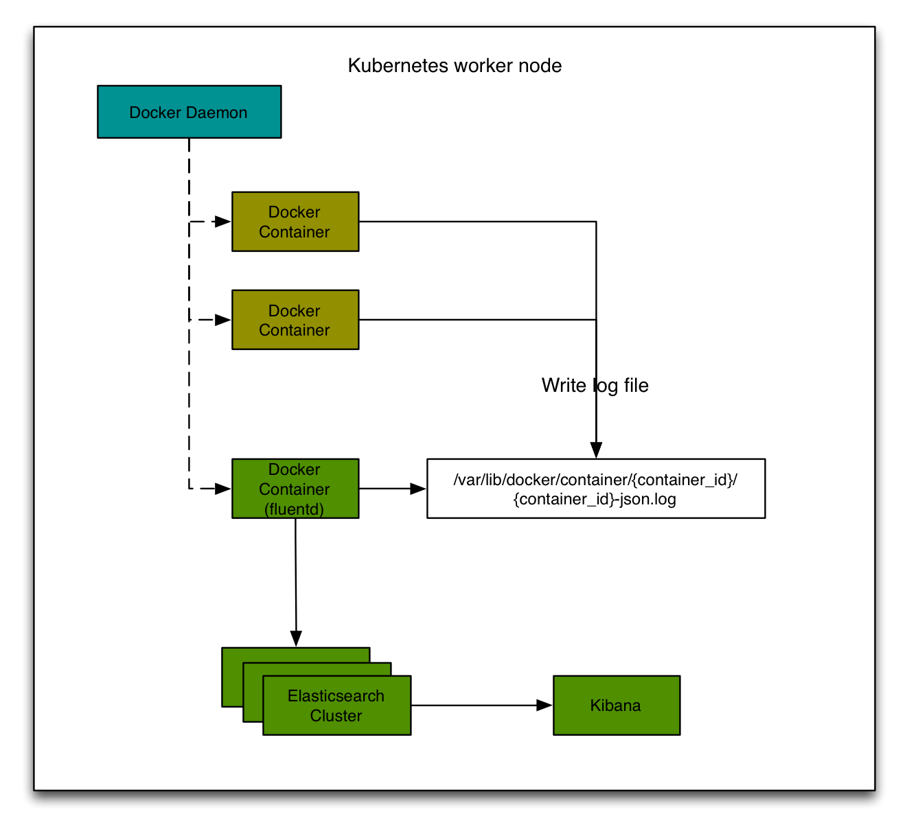

### Kubernetes日志收集与存储
#### 背景
运行在Kubernetes集群中的Continaer，需要一种机制能够将日志收集起来并同时提供存储、查询的功能。

EFK是一种日志的收集，存储，查询的技术方案，其中包括：
* Elasticsearch：提供数据存储以及索引服务
* Fluented：自动收集每个Docker Continaer的stdout和stderr数据，并发送给Elasticsearch
* Kibana：自助的查询UI，提供界面化的查询工具

#### 架构


#### 部署
##### 制作fluentd的Docker Image(若没有定制化fluentd的需求，可跳过此步骤)
* 为了更快的build fluentd的image，准备了一个base image
```
cd custom-fluentd/base
docker build -t {{Your Repo}}/base-fluentd:0.12.29
```
* 可根据集群信息定制化fluented的配置，制作custom-fluentd的镜像
```
cd custom-fluentd
docker build -t {{Your Repo}}/custom-fluentd:0.12.29 ./
```
##### 部署Fluentd
* 通过daemonset的方式部署fluented
由于不同系统上Docker Logs目录的位置有所不同，可修改`fluentd-daemonset.yaml`中hostPath的位置来制定docker logs的路径
```
kubectl create -f fluentd-daemonset.yaml
```

##### 部署Elasticsearch
* 通常来说Elasticsearch集群分为三种角色：
    * Master Node：作为集群的Master节点，负责协调集群状态，不存储数据，对外暴露TCP接口
    * Data Node：作为集群的数据节点，负责索引数据的存储，对外暴露TCP接口
    * Client Node：作为集群对外的查询节点，不存储数据，提供HTTP，TCP接口

Elasticsearch on kubernetes参考：https://github.com/pires/kubernetes-elasticsearch-cluster

部署Service
```
kubectl create -f es-discovery.yaml
kubectl create -f es-svc.yaml
kubectl create -f es-master.yaml
```
等待master节点就绪

```
kubectl create -f es-client.yaml
```
等待client节点就绪

```
kubectl create -f es-data.yaml
```

添加ingress信息以便查看elasticsearch集群信息
```
kubectl create -f es-ingress.yaml
```

##### 部署Kibana

```
kubectl create -f kibana-controller.yaml
kubectl create -f kibana-service.yaml
kubectl create -f logging-ingress.yaml
```

即可通过ingress配置的域名方法Kibana的web界面。
